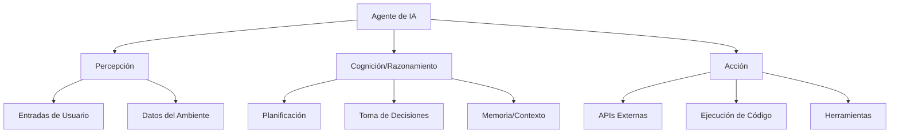
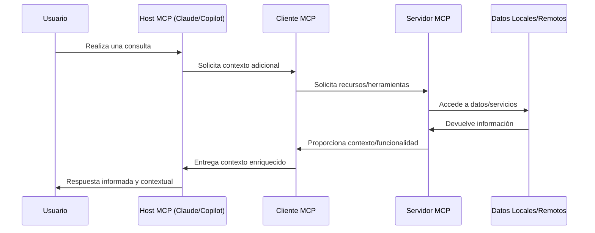
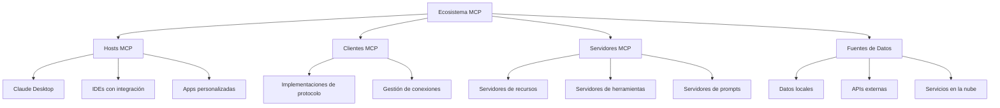
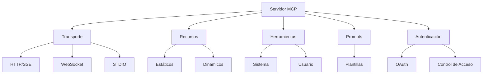
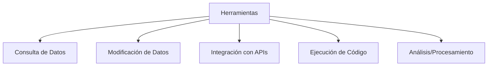
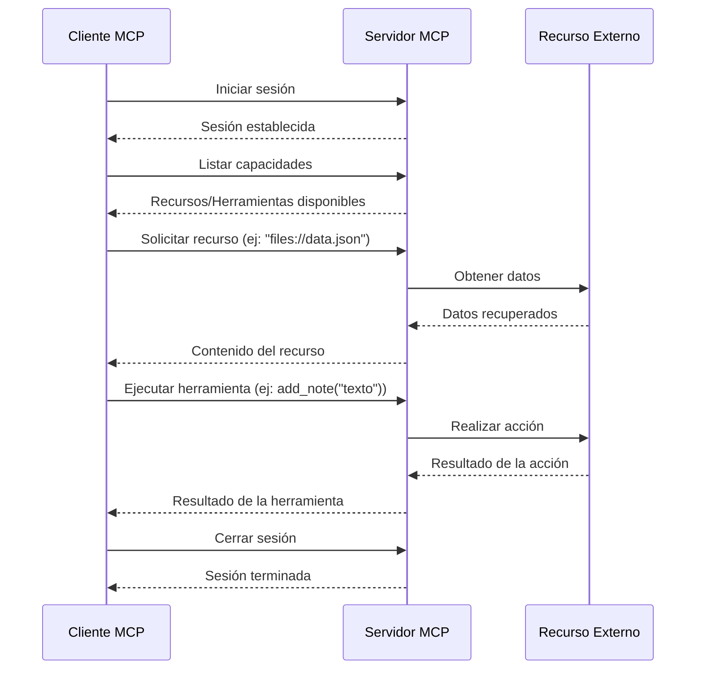

# 🤖 Agentes de IA y el Protocolo MCP

## 📋 Índice
- [Agentes de IA](#1--qué-es-un-agente-de-ia)
- [Protocolo MCP](#2--introducción-a-mcp)
- [Arquitectura MCP](#3--arquitectura-del-ecosistema-mcp)
- [Conclusiones](#-conclusiones)
- [Referencias](#-referencias)

## 1. 🧠 ¿Qué es un Agente de IA?

Un **Agente de IA** es un sistema de software autónomo que percibe su entorno, toma decisiones basadas en esa información y actúa para cumplir objetivos específicos. A diferencia de los modelos de lenguaje convencionales que simplemente generan texto, los agentes tienen capacidades ampliadas.

### ✨ Características principales

- **🔄 Autonomía**: Operan sin intervención humana constante
- **📚 Persistencia**: Mantienen estado y contexto a lo largo del tiempo
- **🔧 Acceso a herramientas**: Usan APIs, ejecutan código y acceden a recursos externos
- **📝 Planificación**: Desarrollan estrategias para lograr objetivos complejos
- **📈 Retroalimentación**: Aprenden de sus interacciones y mejoran con el tiempo

### 🔍 Tipos de Agentes

1. **💬 Asistentes Conversacionales**: GitHub Copilot, Claude, ChatGPT con plugins
2. **⚙️ Agentes Autónomos**: Sistemas que operan continuamente (monitoreo, mantenimiento)
3. **🔄 Agentes Multi-Dominio**: Acceden a múltiples fuentes de conocimiento y herramientas
4. **👥 Agentes Colaborativos**: Diseñados para potenciar las capacidades humanas

## 2. 🌐 Introducción a MCP

El **Model Context Protocol (MCP)** es un protocolo abierto que estandariza cómo las aplicaciones proporcionan contexto a los modelos de lenguaje (LLMs). Funciona como un "puerto USB-C para aplicaciones de IA", conectando modelos con diferentes fuentes de datos y herramientas.

### 🤔 Componentes del ecosistema MCP

- **💻 Hosts MCP**: Aplicaciones como Claude Desktop, VS Code, GitHub Copilot
- **🔄 Clientes MCP**: Componentes que mantienen conexiones 1:1 con servidores
- **🖥️ Servidores MCP**: Programas ligeros que exponen capacidades específicas
- **📂 Fuentes de datos**: Locales (archivos, bases de datos) o remotas (APIs, servicios cloud)

### 🎯 Ventajas de MCP

- **🔌 Integraciones preconfiguradas**: Lista creciente de conectores prediseñados
- **🔄 Flexibilidad**: Cambio sencillo entre diferentes proveedores de LLMs
- **🔒 Seguridad**: Datos sensibles permanecen en infraestructura propia
- **🧩 Extensibilidad**: Capacidades ampliadas sin modificar los modelos base
- **⚙️ Personalización**: Creación de agentes para dominios específicos
- **🔐 Privacidad**: Control sobre qué datos se comparten
- **🔌 Interoperabilidad**: Diferentes herramientas trabajando juntas

## 3. 🏗️ Arquitectura del ecosistema MCP

La arquitectura MCP se divide en componentes bien definidos que trabajan juntos para proporcionar un ecosistema extensible.

### 🧩 Componentes de un servidor MCP

### 🔧 Herramientas

Permiten que los modelos realicen acciones a través del servidor:

### 💬 Prompts y Muestreo

- **Prompts**: Plantillas de instrucciones reutilizables para guiar a los LLMs
- **Muestreo (Sampling)**: Permite a servidores solicitar completaciones desde LLMs

### 🔄 Flujo de comunicación típico

## 📌 Conclusiones

El protocolo MCP representa un avance significativo en cómo interactuamos con los modelos de lenguaje, permitiendo crear sistemas más capaces y contextuales. La implementación de servidores MCP extiende las capacidades de los LLMs sin modificar los modelos subyacentes, creando ecosistemas especializados para diferentes dominios.

Los principales beneficios incluyen:
- Acceso a datos locales y privados
- Ejecución de acciones específicas en sistemas externos
- Consistencia en la integración con diferentes modelos
- Capacidad para crear agentes especializados para dominios específicos

## 📚 Referencias

- [📖 Documentación oficial de MCP](https://modelcontextprotocol.io/introduction)
- [👨‍💻 GitHub Copilot Agents](https://docs.github.com/en/copilot/building-copilot-extensions/building-a-copilot-agent-for-your-copilot-extension/about-copilot-agents)
- [🐍 Python SDK para MCP](https://github.com/modelcontextprotocol/python-sdk)